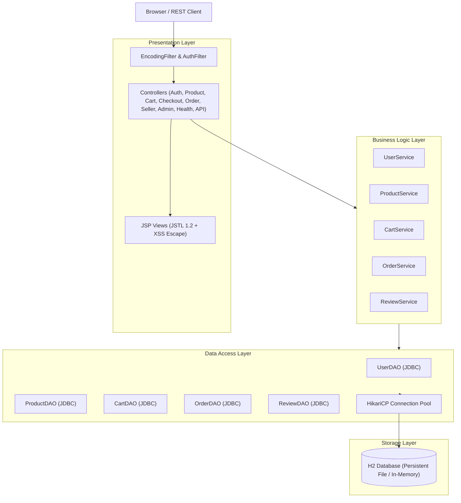

# RubiniMart — Modern E-Commerce Platform Capstone

[](https://github.com/rubinimart/rubinimart/actions/workflows/build.yml)
[](https://openjdk.org/projects/jdk/17/)
[](https://tomcat.apache.org/)
[]()

> **Anna University R2025 Semester 3 Capstone Project**  
> **Target Checkpoint**: September 21 Full Build + Deploy Review (F1 through F8 Complete)

RubiniMart is a multi-vendor e-commerce web application built using **Java Servlets**, **JDBC**, and **Apache Tomcat 9.0.x**. It features strict 3-tier MVC architecture, role-based access control (Buyer, Seller, Admin), atomic database transactions, persistent storage via H2 in server/file mode, comprehensive input validation, and full security hardening.

---

## Architecture Overview



---

## Tech Stack Table

| Component | Technology | Version | Purpose |
|---|---|---|---|
| **Language** | Java | 17 (LTS) | Core backend programming language |
| **Web Container** | Apache Tomcat | 9.0.x (`javax.servlet.*`) | Servlet 4.0 & JSP 2.3 container |
| **Database** | H2 Database | 2.2.224 | Persistent file mode (`./data/rubinimart`) & test in-memory |
| **Connection Pool** | HikariCP | 5.1.0 | High-performance JDBC connection pooling |
| **Security / Hashing** | jBCrypt | 0.4 | Adaptive salt password hashing (12 rounds) |
| **Serialization** | Google Gson | 2.10.1 | JSON responses under `/api/v1/...` |
| **Testing** | JUnit 5 & Mockito | 5.10.2 / 5.11.0 | DAO unit tests (embedded DB) & Service unit tests |
| **Build Tool** | Apache Maven | 3.9+ | Dependency management, build lifecycle, packaging |

---

## Feature Matrix (F1 – F8 + O2)

| ID | Feature | Implementation Details | Status |
|---|---|---|---|
| **F1** | Authentication & Roles | Buyer/Seller signup, seeded Admin, jBCrypt hashing, session fixation prevention, `AuthFilter` | ✅ Complete |
| **F2** | Seller Listings | Create, edit, delete products with title, description, price, stock, category, and image URL | ✅ Complete |
| **F3** | Buyer Browse & Search | Combined keyword search, category dropdown filter, price/rating sorting, and pagination | ✅ Complete |
| **F4** | Cart Management | Add to cart, live quantity adjustment with inventory bounds checks, remove items, running total | ✅ Complete |
| **F5** | Checkout & Payment | Multi-step checkout transaction: inventory lock, order record, items record, mock payment | ✅ Complete |
| **F6** | Order Tracking | Buyer past order history; Seller incoming order fulfillment queue | ✅ Complete |
| **F7** | Admin Panel | Metrics dashboard (GMV, users, orders, products), user list, order oversight, listing moderation | ✅ Complete |
| **F8** | Product Reviews | Verified buyer reviews and 1–5 star ratings on completed orders with average score calculations | ✅ Complete |
| **O2** | Order Lifecycle Workflow | Status transitions: `PENDING` &rarr; `CONFIRMED` &rarr; `SHIPPED` &rarr; `DELIVERED` | ✅ Complete |

---

## Seed Accounts & Credentials

The database automatically initializes with sample data upon first run:

| Role | Email Address | Password | Permissions |
|---|---|---|---|
| **Admin** | `admin@mart.com` | `Admin@123` | Full platform oversight, user management, order logs, product moderation |
| **Seller** | `techseller@mart.com` | `Seller@123` | Electronics seller: manage inventory, update order status |
| **Seller** | `fashionhub@mart.com` | `Seller@123` | Fashion seller: manage inventory, update order status |
| **Buyer** | `john.buyer@mart.com` | `Buyer@123` | Standard shopper: browse, cart, checkout, order history, review |
| **Buyer** | `alice.buyer@mart.com` | `Buyer@123` | Standard shopper: browse, cart, checkout, order history, review |

---

## Getting Started & Local Setup

### Prerequisites
- **JDK 17** or later installed (`java -version`)
- **Apache Maven 3.8+** installed (`mvn -version`)

### 1. Clone the Repository
```bash
git clone https://github.com/rubinimart/rubinimart.git
cd rubinimart
```

### 2. Run All Automated Tests
```bash
mvn clean test
```
*Executes all DAO tests against embedded in-memory H2 and Service tests with Mockito.*

### 3. Start the Server (1-Click Embedded Tomcat)
```bash
mvn compile exec:java
```
Or specify the main class directly:
```bash
mvn compile exec:java -Dexec.mainClass="com.rubinimart.runner.EmbeddedTomcatServer"
```

Once running, access the application in your browser:
- **Web Storefront**: [http://localhost:8080/](http://localhost:8080/)
- **Health Check API**: [http://localhost:8080/api/v1/health](http://localhost:8080/api/v1/health)
- **JSON Products API**: [http://localhost:8080/api/v1/products](http://localhost:8080/api/v1/products)

### 4. Build Deployable WAR (for External Tomcat 9.0.x)
```bash
mvn clean package
```
*Produces `target/RubiniMart.war` which can be dropped into any standard Tomcat 9.0.x `webapps/` folder.*

---

## API Specification

All JSON API endpoints return data inside the standard response envelope:
```json
{
  "success": true,
  "data": { ... },
  "error": null
}
```

| Method | Endpoint | Description |
|---|---|---|
| `GET` | `/api/v1/health` | Health probe returning `{"status":"UP","db":"UP"}` |
| `GET` | `/api/v1/products` | Retrieve catalog list with search, filter, and pagination |
| `GET` | `/api/v1/products?id={id}` | Retrieve specific product details |
| `GET` | `/api/v1/cart` | Retrieve current buyer's cart contents (requires auth) |
| `GET` | `/api/v1/orders` | Retrieve current buyer's order history (requires auth) |

---

## Documentation & Deliverables

- **[D2 Use Case Diagram](docs/D2_USE_CASE_DIAGRAM.md)**: Actor relationships and use case descriptions.
- **[Manual Test Cases](docs/MANUAL_TEST_CASES.md)**: End-to-end verification walkthrough matrix.
- **[Security Checklist](docs/SECURITY_CHECKLIST.md)**: Section 9 audit confirming zero SQL injection, bcrypt hashing, and safe error handling.
- **[CI Workflow](.github/workflows/build.yml)**: Continuous integration configuration for automated testing.
