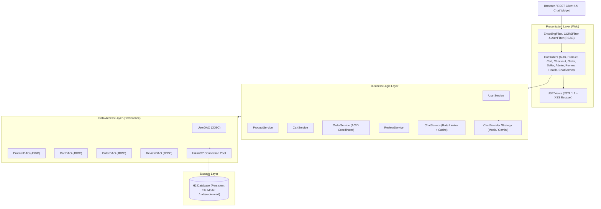

# RubiniMart — Enterprise-Grade E-Commerce Platform & AI Assistant

[](https://openjdk.org/projects/jdk/17/)
[](https://tomcat.apache.org/)
[]()
[](https://rubinimart.onrender.com)
[]()

> **Anna University R2025 Semester 3 Capstone Project**  
> **Evaluation Window**: Jul 27 – Oct 10, 2026 (Kickoff to Final Review Complete)  
> **Author**: Rubini (`com.rubinimart`)  
> **Live Production URL**: [https://rubinimart.onrender.com](https://rubinimart.onrender.com)  
> **GitHub Repository**: [https://github.com/Rubiniponnar/RubiniMart](https://github.com/Rubiniponnar/RubiniMart)  

---

## Executive Overview

**RubiniMart** is an enterprise-grade multi-role e-commerce web platform built with **Java Servlets**, **JDBC**, and **Apache Tomcat 9.0.x**. It implements strict 3-tier MVC architecture, role-based access control (Buyer, Seller, Admin), ACID atomic checkout transactions, persistent storage via H2 in server/file mode, comprehensive input validation, full security hardening, and an embedded modular **AI Shopping Assistant (O4)**.

---

## Architecture Overview


```mermaid
flowchart TD
    Client["Browser / REST Client / AI Chat Widget"]

    subgraph Presentation ["Presentation Layer (Web)"]
        Filter["EncodingFilter, CORSFilter & AuthFilter (RBAC)"]
        Servlets["Controllers (Auth, Product, Cart, Checkout, Order, Seller, Admin, Review, Health, ChatServlet)"]
        Views["JSP Views (JSTL 1.2 + XSS Escape <c:out>)"]
    end

    subgraph ServiceLayer ["Business Logic Layer"]
        UserService["UserService"]
        ProductService["ProductService"]
        CartService["CartService"]
        OrderService["OrderService (ACID Coordinator)"]
        ReviewService["ReviewService"]
        ChatService["ChatService (Rate Limiter + Cache)"]
        ChatProvider["ChatProvider Strategy (Mock / Gemini)"]
    end

    subgraph DataAccess ["Data Access Layer (Persistence)"]
        UserDAO["UserDAO (JDBC)"]
        ProductDAO["ProductDAO (JDBC)"]
        CartDAO["CartDAO (JDBC)"]
        OrderDAO["OrderDAO (JDBC)"]
        ReviewDAO["ReviewDAO (JDBC)"]
        Hikari["HikariCP Connection Pool"]
    end

    subgraph Storage ["Storage Layer"]
        H2[("H2 Database (Persistent File Mode: ./data/rubinimart)")]
    end

    Client --> Filter
    Filter --> Servlets
    Servlets --> Views
    Servlets --> ServiceLayer
    ServiceLayer --> ChatProvider
    ServiceLayer --> DataAccess
    DataAccess --> Hikari
    Hikari --> H2
```

---

## Tech Stack

| Component | Technology | Version | Purpose |
| :--- | :--- | :--- | :--- |
| **Language** | Java | 17 (LTS) | Core backend programming language |
| **Web Container** | Apache Tomcat | 9.0.87 (`javax.servlet.*`) | Servlet 4.0 & JSP 2.3 container |
| **Database** | H2 Database | 2.2.224 | Persistent file mode (`./data/rubinimart`) & test in-memory |
| **Connection Pool** | HikariCP | 5.1.0 | High-performance JDBC connection pooling |
| **Security / Hashing**| jBCrypt | 0.4 | Adaptive salt password hashing (12 rounds) |
| **JSON Serialization**| Google Gson | 2.10.1 | JSON responses under `/api/` & Chatbot API |
| **AI LLM Subsystem** | Google Gemini / Mock | v1beta | Conversational product assistant with rate limiting |
| **Testing** | JUnit 5 & Mockito | 5.10.2 / 5.11.0 | 30 unit & integration tests (0 failures) |
| **DevOps / Hosting** | Docker & Render | Multi-Stage | Containerized cloud deployment with automatic CI/CD |

---

## Complete Feature Matrix (F1 – F8 + O2 + O4)

| ID | Feature | Implementation Details | Status |
| :--- | :--- | :--- | :--- |
| **F1** | Authentication & Roles | Buyer & Seller registration, seeded Admin, jBCrypt hashing, session fixation prevention, `AuthFilter` RBAC | ✅ Complete |
| **F2** | Seller Listings | Create, edit, soft-delete products with title, description, price (₹), stock, category, image URL | ✅ Complete |
| **F3** | Buyer Browse & Search | Combined keyword search, category filter (5 categories), price/rating sorting, and pagination | ✅ Complete |
| **F4** | Cart Management | Add to cart, live quantity adjustment with inventory bounds checks, remove items, running total in ₹ | ✅ Complete |
| **F5** | Checkout & Payment | ACID multi-step checkout: inventory lock, atomic stock deduction, order persistence, mock payment (Card, UPI, COD) | ✅ Complete |
| **F6** | Order Tracking | Buyer past order history; Seller incoming order fulfillment queue | ✅ Complete |
| **F7** | Admin Governance | Metrics dashboard (GMV in ₹, users, orders, products), user list, order oversight, listing moderation | ✅ Complete |
| **F8** | Product Reviews | Verified buyer reviews and 1–5 star ratings on completed orders with average score recalculation | ✅ Complete |
| **O2** | Order Lifecycle Workflow | State transitions: `PENDING` &rarr; `CONFIRMED` &rarr; `SHIPPED` &rarr; `DELIVERED` | ✅ Complete |
| **O4** | AI Shopping Assistant | Floating chat widget with sliding-window rate limiter (10 msg/min), session cache, Dual-Provider Strategy (Mock / Gemini) | ✅ Complete |

---

## Seed Accounts & Demo Credentials

| Role | Email Address | Password | Permissions & Test Access |
| :--- | :--- | :--- | :--- |
| **Buyer** | `john.buyer@mart.com` | `Buyer@123` | Browse catalog, cart management, mock checkout, track orders, reviews |
| **Seller** | `techseller@mart.com` | `Seller@123` | Electronics seller: manage inventory, update order fulfillment status |
| **Seller** | `fashionhub@mart.com` | `Seller@123` | Fashion seller: manage inventory, update order fulfillment status |
| **Admin** | `admin@mart.com` | `Admin@123` | Master administrator: view platform GMV, user accounts, moderate listings |

---

## Getting Started & Local Setup

### 1. Clone & Test
```bash
git clone https://github.com/Rubiniponnar/RubiniMart.git
cd RubiniMart
mvn clean test
```
*Executes all 30 unit & integration tests (`BUILD SUCCESS`).*

### 2. Launch Local Server
```bash
mvn compile exec:java
```
Access the application:
- **Web Storefront**: [http://localhost:8085/](http://localhost:8085/)
- **Health Check API**: [http://localhost:8085/api/v1/health](http://localhost:8085/api/v1/health)
- **AI Chatbot API**: [http://localhost:8085/api/chat](http://localhost:8085/api/chat)

---

## Academic Documentation & Evaluation Deliverables

All deliverables required by the **Anna University R2025 Student Guide** are fully documented:

| Deliverable | Document Link | Description |
| :--- | :--- | :--- |
| **Final Capstone Report** | [`docs/FINAL_REPORT.md`](docs/FINAL_REPORT.md) | Comprehensive 10-section academic report meeting R2025 standards |
| **Slide Deck** | [`docs/SLIDE_DECK.md`](docs/SLIDE_DECK.md) | 10-slide evaluation presentation deck with speaking points |
| **5-Minute Live Demo Script** | [`docs/DEMO_SCRIPT.md`](docs/DEMO_SCRIPT.md) | Rehearsed minute-by-minute walkthrough with exact click paths |
| **D1: Entity-Relationship Diagram** | [`docs/D1_ER_DIAGRAM.md`](docs/D1_ER_DIAGRAM.md) | Mermaid ERD covering all 6 database entities and constraints |
| **D2: Use Case Diagram** | [`docs/D2_USE_CASE_DIAGRAM.md`](docs/D2_USE_CASE_DIAGRAM.md) | Use case specification covering F1–F8 + O2 + O4 across all personas |
| **D3: Place-Order Sequence Diagram** | [`docs/D3_SEQUENCE_DIAGRAM.md`](docs/D3_SEQUENCE_DIAGRAM.md) | ACID atomic checkout transaction lifecycle |
| **D4: AI Chatbot Sequence Diagram** | [`docs/D4_CHATBOT_SEQUENCE_DIAGRAM.md`](docs/D4_CHATBOT_SEQUENCE_DIAGRAM.md) | Chatbot request lifecycle, rate limiter, cache, and provider fallback |
| **Security Checklist** | [`docs/SECURITY_CHECKLIST.md`](docs/SECURITY_CHECKLIST.md) | Section 9 compliance verification matrix |
| **Manual Test Cases** | [`docs/MANUAL_TEST_CASES.md`](docs/MANUAL_TEST_CASES.md) | End-to-end verification walkthrough matrix |
| **Sprint Retrospective Log** | [`RETRO.md`](RETRO.md) | Weekly retrospective log from Kickoff through Week 11 |
| **Contributor Guide** | [`CONTRIBUTING.md`](CONTRIBUTING.md) | Developer onboarding guide from clone to running instance |
