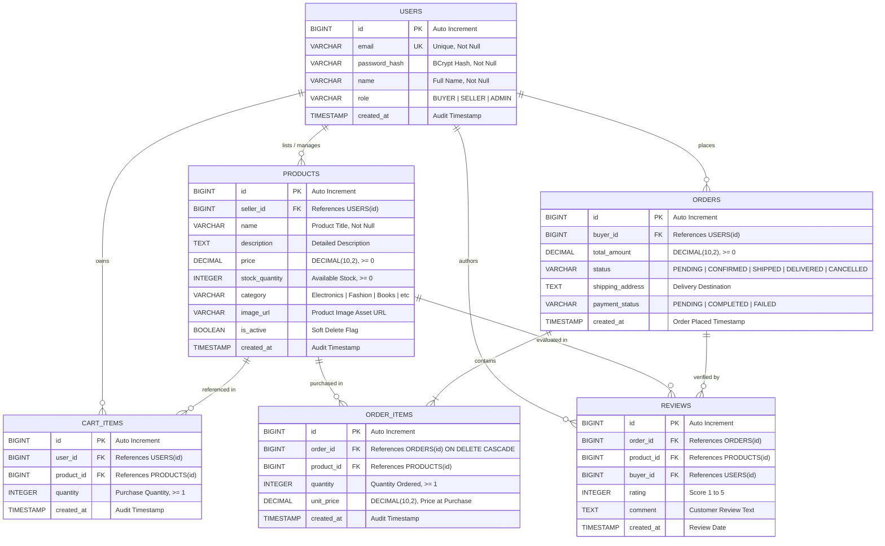

# D1: RubiniMart Entity-Relationship Diagram (ERD)

## Database Architecture Overview
The **RubiniMart** relational schema is implemented on **H2 Database** (v2.2.x) in persistent file mode (`jdbc:h2:file:./data/rubinimart`). It comprises 6 normalized relational entities engineered with:
- Strict primary key (`id BIGINT AUTO_INCREMENT PRIMARY KEY`) design.
- `DECIMAL(10,2)` representation for currency values to eliminate floating-point rounding errors.
- Foreign key constraints with cascading or restricting integrity rules.
- Explicit database indexes on high-frequency search and join foreign keys.
- Timestamp auditing (`created_at TIMESTAMP DEFAULT CURRENT_TIMESTAMP`) across all tables.

---

## Mermaid Entity-Relationship Diagram

---

## Entity Specifications & Constraints

| Table Name | Primary Key | Foreign Keys | Key Constraints | Description |
| :--- | :--- | :--- | :--- | :--- |
| `users` | `id` | None | `email UNIQUE NOT NULL`, `role IN ('BUYER', 'SELLER', 'ADMIN')` | Stores credentials and user personas |
| `products` | `id` | `seller_id` &rarr; `users(id)` | `price >= 0`, `stock_quantity >= 0`, `is_active DEFAULT TRUE` | Active and moderated product listings |
| `cart_items` | `id` | `user_id` &rarr; `users(id)`, `product_id` &rarr; `products(id)` | `quantity >= 1`, unique compound index `(user_id, product_id)` | Session shopping cart with running total |
| `orders` | `id` | `buyer_id` &rarr; `users(id)` | `status IN ('PENDING','CONFIRMED','SHIPPED','DELIVERED','CANCELLED')` | Buyer orders and fulfillment status |
| `order_items` | `id` | `order_id` &rarr; `orders(id)`, `product_id` &rarr; `products(id)` | `quantity >= 1`, `unit_price >= 0` | Historical snapshot of items and price at checkout |
| `reviews` | `id` | `order_id`, `product_id`, `buyer_id` | `rating BETWEEN 1 AND 5` | Verified customer reviews and ratings |
