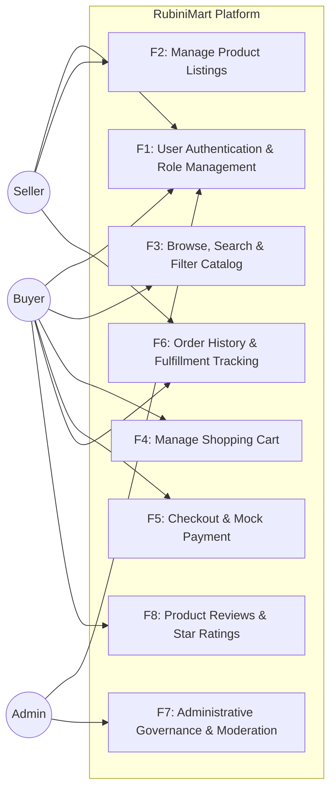

# RubiniMart — D2 Use Case Diagram & Specification

## Overview
This document specifies the Use Cases (F1 through F8) for **RubiniMart**, mapping all core business requirements to the corresponding system actors: **Buyer**, **Seller**, and **Admin**.

---

## Detailed Feature Specifications (F1 – F8)

| Feature ID | Name | Actor(s) | Description |
|---|---|---|---|
| **F1** | Registration & Authentication | Buyer, Seller, Admin | Role-based signup for Buyer and Seller. Admin is a seeded master account. Passwords hashed using jBCrypt with 12 rounds. Session regeneration on login prevents fixation attacks. |
| **F2** | Product Listing Management | Seller | Sellers can create, update, and delete product listings with name, description, category, price, stock quantity, and image URL. |
| **F3** | Catalog Browsing & Search | Buyer | Buyers browse active products with keyword search (name/description), category filtering, price/rating sorting, and pagination. |
| **F4** | Cart Management | Buyer | Buyers can add items, update quantities with inventory bounds check, remove items, and view a real-time running subtotal and total. |
| **F5** | Checkout & Mock Payment | Buyer | Multi-step checkout transaction: validates inventory, deducts stock atomically, creates order and order items, clears the cart, and confirms mock payment. |
| **F6** | Order Tracking & Fulfillment | Buyer, Seller | Buyers view personal order history with status progression. Sellers view incoming orders for their products and advance status (`PENDING` → `CONFIRMED` → `SHIPPED` → `DELIVERED`). |
| **F7** | Admin Moderation & Oversight | Admin | View overall platform metrics (GMV, total users, orders, products), view all accounts, view all orders, and toggle active/disabled status of listings. |
| **F8** | Product Reviews & Star Ratings | Buyer | Buyers who purchased an item in a confirmed/shipped/delivered order can submit a 1–5 star rating and comment. Ratings update the product's average score dynamically. |
