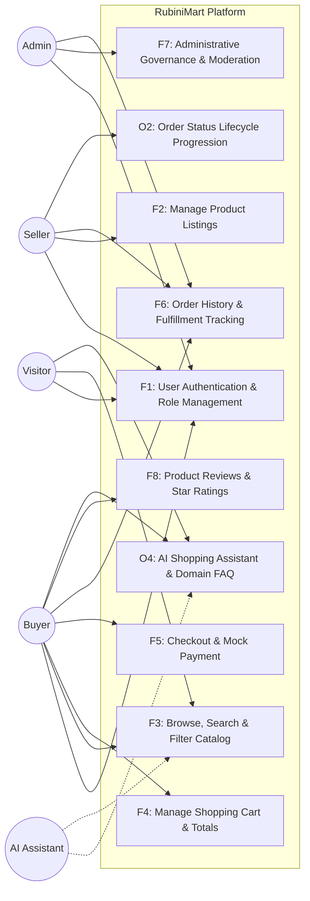

# RubiniMart — D2 Use Case Diagram & Specification

## Overview
This document specifies the Use Cases (F1 through F8 + O2 + O4) for **RubiniMart**, mapping all core business requirements to the corresponding system actors: **Visitor**, **Buyer**, **Seller**, **Admin**, and **AI Chatbot**.

---

## Mermaid Use Case Diagram

```mermaid
flowchart LR
    Visitor((Visitor))
    Buyer((Buyer))
    Seller((Seller))
    Admin((Admin))
    Bot((AI Assistant))

    subgraph RubiniMart Platform
        UC1["F1: User Authentication & Role Management"]
        UC2["F2: Manage Product Listings"]
        UC3["F3: Browse, Search & Filter Catalog"]
        UC4["F4: Manage Shopping Cart & Totals"]
        UC5["F5: Checkout & Mock Payment"]
        UC6["F6: Order History & Fulfillment Tracking"]
        UC7["F7: Administrative Governance & Moderation"]
        UC8["F8: Product Reviews & Star Ratings"]
        UC9["O2: Order Status Lifecycle Progression"]
        UC10["O4: AI Shopping Assistant & Domain FAQ"]
    end

    Visitor --> UC1
    Visitor --> UC3
    Visitor --> UC10

    Buyer --> UC1
    Buyer --> UC3
    Buyer --> UC4
    Buyer --> UC5
    Buyer --> UC6
    Buyer --> UC8
    Buyer --> UC10

    Seller --> UC1
    Seller --> UC2
    Seller --> UC6
    Seller --> UC9

    Admin --> UC1
    Admin --> UC7
    Admin --> UC6

    Bot -.-> UC10
    Bot -.-> UC3
```

---

## Detailed Feature Specifications (F1 – F8 + O2 + O4)

| Feature ID | Name | Actor(s) | Description |
|---|---|---|---|
| **F1** | Registration & Authentication | Visitor, Buyer, Seller, Admin | Role-based signup for Buyer and Seller. Admin is a seeded master account. Passwords hashed using jBCrypt with 12 rounds. Session regeneration on login prevents fixation attacks. |
| **F2** | Product Listing Management | Seller | Sellers can create, update, and soft-delete product listings with title, description, category, price (₹), stock quantity, and image URL. |
| **F3** | Catalog Browsing & Search | Visitor, Buyer | Browse active products with combined category filtering, keyword search, price/newest sorting, and pagination. |
| **F4** | Cart Management | Buyer | Add items, update quantities with inventory bounds check, remove items, and view real-time running subtotal and total in ₹. |
| **F5** | Checkout & Mock Payment | Buyer | Atomic checkout transaction: validates inventory, deducts stock, creates order and order items, clears the cart, and confirms mock payment (Card / UPI / COD). |
| **F6** | Order Tracking & History | Buyer, Seller | Buyers view personal order history with status progression. Sellers view incoming orders for their products. |
| **F7** | Admin Moderation & Oversight | Admin | View platform metrics (GMV in ₹, total users, orders, products), view all accounts, view all orders, and toggle active status of listings. |
| **F8** | Product Reviews & Star Ratings | Buyer | Buyers who received items can submit a 1–5 star rating and comment. Ratings recalculate product averages dynamically. |
| **O2** | Order Status Workflow | Seller, Admin | Formal state transition machine: `PENDING` &rarr; `CONFIRMED` &rarr; `SHIPPED` &rarr; `DELIVERED` with audit timestamps. |
| **O4** | AI Shopping Assistant | Visitor, Buyer | Floating conversational bot providing grounded answers on the 28 products, INR pricing, shipping, returns, order tracking, and policies with rate limiting (10 msg/min). |
