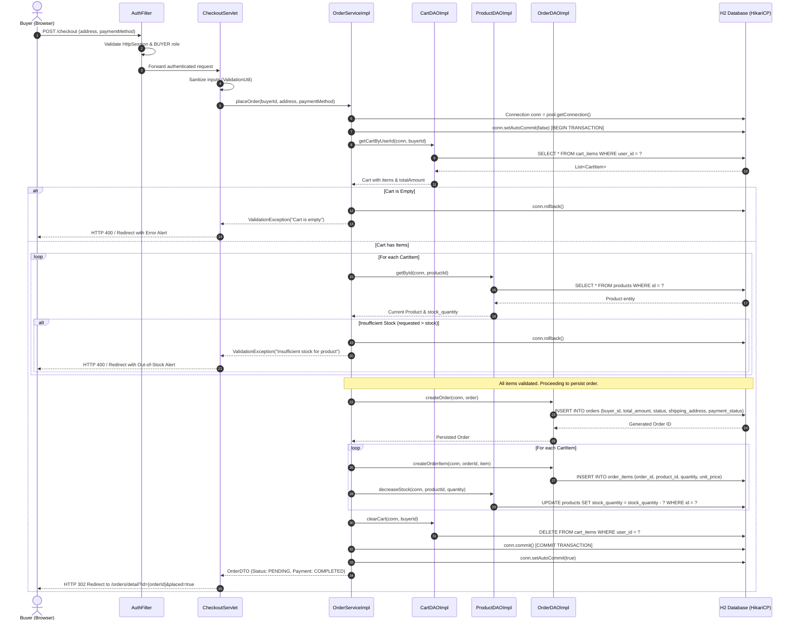

# D3: RubiniMart Place-Order Transaction Sequence Diagram

## Transactional Architecture
The **Place-Order flow** in RubiniMart is engineered as an **ACID-compliant atomic transaction** managed via JDBC Connection controls (`setAutoCommit(false)`, `commit()`, `rollback()`). If inventory becomes insufficient or a database constraint fails, the entire transaction rolls back cleanly, preventing inventory leakage and inconsistent order states.

---

## Mermaid Sequence Diagram

