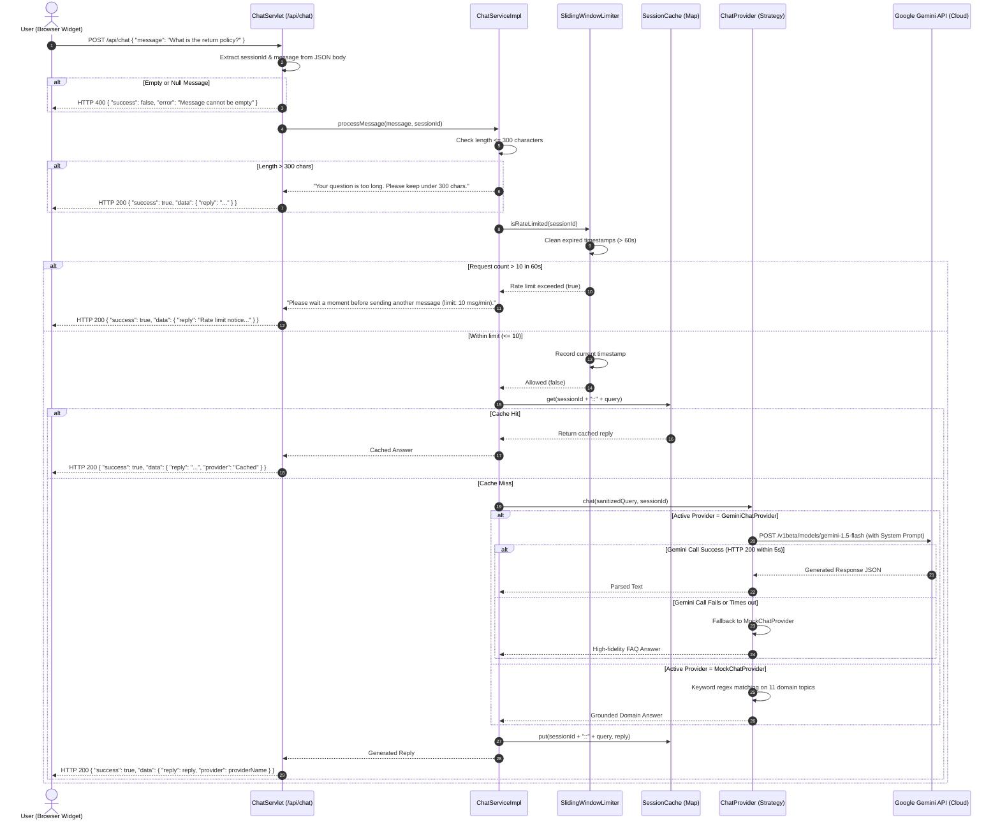

# D4: RubiniMart AI Chatbot Request Flow Sequence Diagram

## Chatbot Subsystem Architecture
The **RubiniMart AI Chatbot** (Phase 3 / Section 11) is engineered as an asynchronous, defensive subsystem that decouples client UI interactions from external LLM availability:
1. **Sliding-Window Rate Limiter**: Strictly prevents abuse (maximum 10 messages per minute per user session).
2. **In-Memory LRU Cache**: Eliminates redundant compute and latency on repeated identical domain inquiries.
3. **Strategy Pattern Provider**: Interchanges dynamically between local `MockChatProvider` and `GeminiChatProvider`.
4. **Graceful Degradation**: Protects user experience with static fallback answers if API rate limits or network partitions occur.

---

## Mermaid Sequence Diagram

